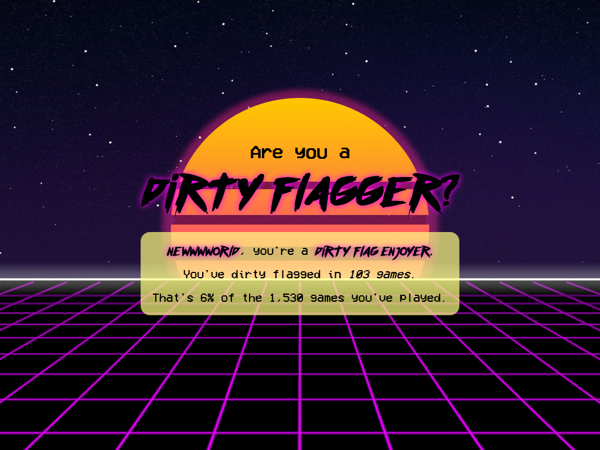

# Dirty Flag

Check how many times you've dirty-flagged someone on Lichess. https://dirtyflag.thomasbroadley.com



## Developer setup

```shell
pip3 install flask python-dotenv authlib berserk stockfish

git clone https://github.com/tbroadley/lichess_dirty_flag
cd lichess_dirty_flag
```

[Download Stockfish](https://stockfishchess.org/download/) and unzip it into the `lichess_dirty_flag`. Follow the instructions in `lichess_dirty_flag/stockfish/README.md` to build Stockfish.

```shell
python3 app.py
```

## What's a dirty flag?

For a more poetic answer, see https://dirtyflag.thomasbroadley.com/faq.

A dirty flag is currently defined as a win on time where the position at the end of the game was drawn (up to +-0.1) or losing for the logged-in user. I'm open to suggestions for improving this. (See the TODO section for some ideas.)

## TODO

- Improved definition of a dirty flag
  - Change it so that you need to be losing or in a drawn position for 80% of the last phase of the game (whether that's the midgame or endgame -- games that don't make it past the opening don't count)
  - Is there a way to acquire a lot of games that people thought were dirty flags?
- Chess.com support
